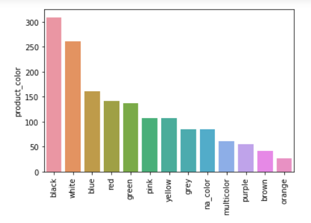

# Wish Sales Projection: Project Overview

* Created models to predict the sales of items listed on the eCommerce site Wish given listed items and factors pertaining to the sales
* Performed feature engineering on various columns to help the model to perform better
* Optimized K Nearest Neighbor, Support Vector Machines, Decision Trees, Random Forest, and XGboost using GridSearchCV to reach the best model
* Utilized an image recognition API to process image data of listed items and add additional information

## Code and Resources Used
<strong>Python Version</strong>: 3.7.6

<strong>Packages</strong>: pandas, numpy, scikit-learn, matplotlib, seaborn

<strong>Kaggle Dataset</strong>: https://www.kaggle.com/jmmvutu/summer-products-and-sales-in-ecommerce-wish

<strong>Image Categorization API</strong>: https://imagga.com/auto-categorization-demo

## Data Cleaning

After acquiring the data, I needed to clean it so that it was usable for the model. I made the following changes:

* Added column with the number of other listings the merchant has in the data
* Cleaned various NaN and null entries within the dataset
* Reduced dimensionality of color and size columns
* Removed interdependent variables
* Processed tag variable using one hot encoding

## Exploratory Data Analysis

## Model Building

A train-test split was performed on the dataset with a test size of 20%. Furthermore, k-fold cross validation was utilized as a means of estimating the in-sample accuracy with k = 10. 

At this stage, performance was evaluated based on accuracy.

Five machine learning algorithms were considered for this data including:

* K Nearest Neighbor - Utilized as the dataset was not extremely large and thus computationally expensive
* Support Vector Machine - Considered due to needing a classifier
* Decision Trees - Used due to the class nature of many independent and dependent variables
* Random Forest - Ensemble method for decision trees
* XGBoost - Ensemble method more optimized for performance

## Model Performance

### Initial Model Accuracy

I tested various models 

* K Nearest Neighbor: Train Accuracy = 46%
* SVM with Linear Kernel: Train Accuracy = 40.86%
* Decision Trees: Train Accuracy = 48.25%
* Random Forest: Train Accuracy = 49.87%
* XGBoost: Train Accuracy = 46.98%

The Random Forest performed the best of the all the models tested.

### Hyperparameter Optimization

After determining the best model to be Random Forest classifier, I used GridSearchCV to tune the hyperparameters of the model.

I considered max depth, max features, min samples leaf, min samples split, and n estimators as the hyperparameters to be optimized.

Following GridSearchCV, the model had an accuracy of 52.70%.

